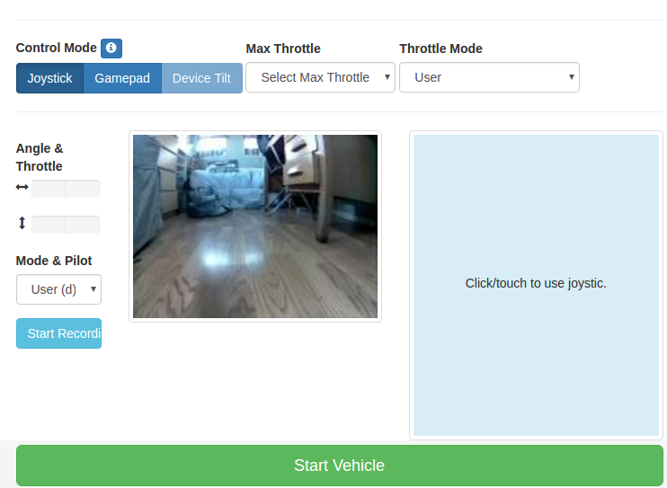

# Drive your car

After you've [calibrated](/guide/calibrate) your car you can start driving it. 

If you are not already, please [ssh into your vehicle](/guide/robot_sbc/setup_raspberry_pi/#step-5-connecting-to-the-pi).

## Start your car
 
> *** Put your car in a safe place where the wheels are off the ground ***.

This is the step were the car can take off. 

Open your car's folder and start your car. 
```
cd ~/mycar
python manage.py drive
```

This script will start the drive loop in your car which includes a part that 
is a web server for you to control your car. You can now control your car
from a web browser at the URL: `<your car's hostname.local>:8887`



## Driving with Web Controller
On your phone you can now press start to set your phones current tilt to be
zero throttle and steering. Now tilting your phone forward will increase throttle and tilting it side to side will turn the steering. 

### Features

* Recording - Press record data to start recording images, steering angels and throttle values. 
* Throttle mode - Option to set the throttle as constant. This is used in 
races if you have a pilot that will steer but doesn't control throttle. 
* Pilot mode - Choose this if the pilot should control the angle and/or throttle.
* Max throttle - Select the maximum throttle.

### Keyboard shortcuts

* `space` : stop car and stop recording
* `r` : toggle recording
* `i` : increase throttle
* `k` : decrease throttle
* `j` : turn left 
* `l` : turn right 

-----

If you don't have a joystick then you can skip to next section - [train an autopilot](/guide/train_autopilot/).

-----

## Driving with Physical Joystick Controller

You may find that it helps to use a physical joystick device to control your vehicle.

### Setup Bluetooth and pair joystick

Check the [Controllers](/parts/controllers/#physical-joystick-controller) section to read about setting up the bluetooth connection.

### Start car

```bash
cd ~/mycar
python manage.py drive --js
```

Optionally, if you want joystick use to be sticky and don't want to add the --js each time, modify your __myconfig.py__ so that __USE_JOYSTICK_AS_DEFAULT = True__

```bash
nano myconfig.py
```

### Joystick Controls

* Left analog stick - Left and right to adjust steering
* Right analog stick - Forward to increase forward throttle
* Pull back twice on right analog to reverse

> Whenever the throttle is not zero, driving data will be recorded - as long as you are in User mode!

* Select button switches modes - "User, Local Angle, Local(angle and throttle)"
* Triangle - Increase max throttle
* X  - Decrease max throttle
* Circle - Toggle recording (disabled by default. auto record on throttle is enabled by default)
* dpad up - Increase throttle scale
* dpad down - Decrease throttle scale
* dpad left - Increase steering scale
* dpad right - Decrease steering scale
* Start - Toggle constant throttle. Sets to max throttle (modified by X and Triangle).

-----

### Next let's [train an autopilot](/guide/train_autopilot/).
